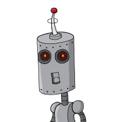

# Robohash Animated SVG in svelte

Construct robot avatar scalable vector image from any text. Construction can be done in the browser. Make the robots come alive by starting the SVG animations.



Visit [this demo site](https://robohash-animated-svg-svelte-hml93a2j1-mbracher.vercel.app/) to see a working demo for controlling the animations and changing the robots.

## WIP
- [ ] Make animations for all the robots. Currently only for one variant of the eyes we have an animation
- [ ] Look into SSR where the robot could be rendered on the server
- [ ] Learn more svelte and refactor to be more idomatic svelte

## Install
```bash
npm install -D robohash-animated-svg-svelte
```

## Usage (Svelte)
```svelte
<script  lang="ts">
  import { RobohashAnimatedSvg } from "robohash-animated-svg-svelte";

  let robot: RobohashAnimatedSvg;
</script>

<RobohashAnimatedSvg bind:this={robot} width={500} height={500} value="VCpL+ttOxnunjiptuA5AB+JjFYcAFOMOVPuVLt/HE2Q="/>

<button on:click={() => robot.start()}>start animation</button>
<button on:click={() => robot.stop()}>stop animation</button>
```

Any text in the value property will be hashed and from the hash we construct a robot. We construct the same robot as Robohash does.

## References
[Robohash](https://robohash.org/) robots created by Zikri Kader

Svg version of robots came from [elapouya django-robohash-svg](https://github.com/elapouya/django-robohash-svg).

Origin of the svg robots is [nimiq](https://github.com/nimiq/robohash) who also wrote this [design blog post](https://medium.com/nimiq/devblog-2-identicons-be50dca91d55). 

## Contribute
If you have suggestions for how this app could be improved, or want to report a bug, open an issue! We'd love all and any contributions.

## License
Licensed under either of

- Apache License, Version 2.0 ([LICENSE-APACHE](LICENSE-APACHE) or
  http://www.apache.org/licenses/LICENSE-2.0)
- MIT license ([LICENSE-MIT](LICENSE-MIT) or http://opensource.org/licenses/MIT)

at your option.

### Contribution

Unless you explicitly state otherwise, any contribution intentionally submitted for inclusion in the
work by you, as defined in the Apache-2.0 license, shall be dual licensed as above, without any
additional terms or conditions.